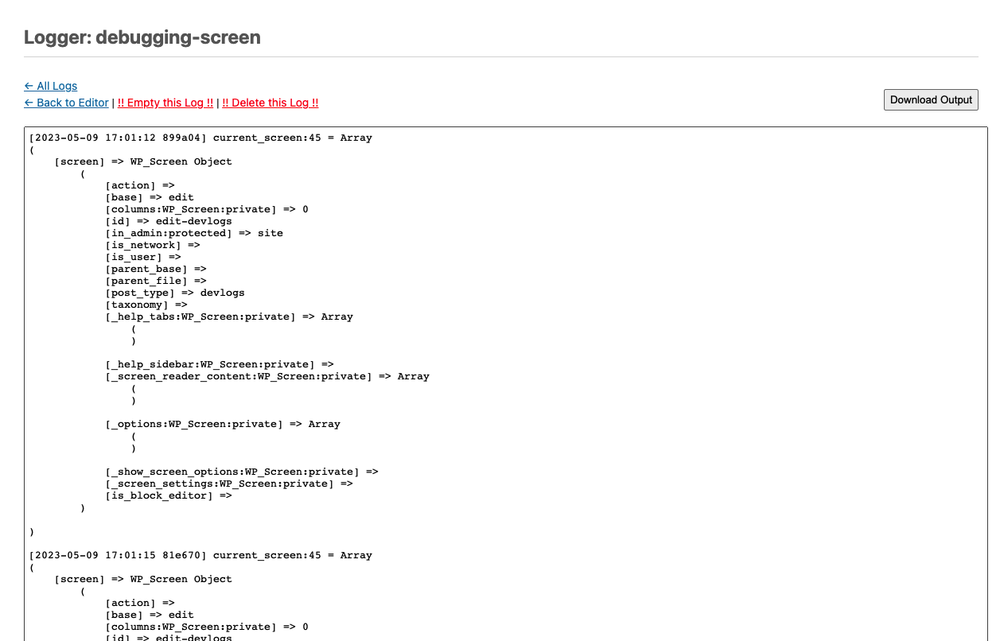

# A post-type Logger/debugger

Useful when server-side logs are unreliable (due to server load balancing, etc).

## Usage
Add hooks like the following to your code to implement logging:

```php
add_action( 'current_screen', function( $screen ) {
   do_action( 'logDebugContent', 'debugging-screen', current_filter() . ':' . __LINE__, get_defined_vars() );
} );
```

### Viewing logs
Post-type url: `<admin_url>/edit.php?post_type=devlogs`


